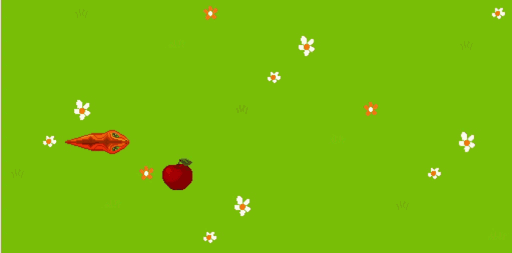

# Snake Game in RISC-V Assembly

## 1. Introduction

In this project, we present a simple yet entertaining Snake game implemented using RISC-V Assembly language, running on a simulated processor with a memory-mapped I/O system.
It leverages timer and keyboard interrupts to handle user inputs and control game updates efficiently. The project features a modular structure, utilizing separate files for managing game logic, data structures, and utility functions, resulting in a clean and maintainable codebase.

## 2. Project Structure

This project consists of the following files:

*   `main.s`: This is the main file that handles timer and keyboard interruptions. It calls the `game_step` function every 0.2 seconds and sends it the last move command from the keyboard. It sets up the interrupt handlers, initializes the timer, and manages the main loop of the program.
*   `game_data.s`: Contains all static data, including screen size, field size, frame time, and snake data.
*   `game_step.s`: Contains the main game loop, which calls various functions every frame and updates the game based on user input.
*   `snake.s`: Encapsulates the game logic, handling snake movement and direction changes.
*   `circle_array.s`: Provides a circular array data structure that supports efficient push and pop operations in O(1) time, which is essential for managing the snake's body segments.

## 3. Game Logic

The game logic in this project is primarily implemented in the `game_step.s` file. It is responsible for handling the snake's movement, detecting collisions with itself, and managing the snake's growth when it consumes food. The main game loop in main.s calls the game_step function every 0.2 seconds, passing the last input from the keyboard as a parameter. The snake moves in the direction of the last input (using 'w', 'a', 's', 'd' keys) and updates its position accordingly. The game detects collisions and handles the snake's growth by utilizing the circular buffer data structure provided in circle_array.s. The game continues until the snake collides with itself.

## 4.  Building and Running the Game

To build and run the Snake game, follow the steps below:

1.  Install the RARS simulator from [GitHub](https://github.com/TheThirdOne/rars)(tested with v1.6).
2.  Open the `main.s` file in RARS and compile it.
3.  In the RARS menu topbar, click on "Tools" and open the "Timer Tool," "Keyboard and Display MMIO Simulator," and "Bitmap Display."
4.  In the Bitmap Display settings, change the "Base Address" to `0x10040000`.
5.  Click on the "Connect to Program" button in each of the tools (Timer Tool, Keyboard and Display MMIO Simulator, and Bitmap Display).
6.  Start the Timer by clicking "Play" in the Timer Tool.
7.  Run the project in RARS.
8.  Place the cursor in the bottom frame of the Keyboard Tool, and enjoy the game. Control the snake using the WASD keys.

##

- Use FPGRARS for speed up an convenience
- Add animations
- Rars don't support big textures